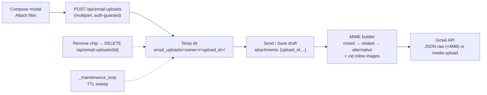

# Plan: Email Attachments for RFQ Supplier Emails

## Implementation Status

| Phase | Description | Status |
|-------|-------------|--------|
| **1** | Settings: `EMAIL_ATTACHMENT_MAX_MB`, `EMAIL_ATTACHMENT_TOTAL_MB`, `EMAIL_UPLOAD_TTL_HOURS` | ❌ Not started |
| **2** | `includes/dashboard/email_uploads.py` — owner-scoped transient store | ❌ Not started |
| **3** | `POST /api/email-uploads` + `DELETE /api/email-uploads/{id}` | ❌ Not started |
| **4** | MIME builder (`mixed` → `related` → `alternative`) + `cid:` inline images + text alternative | ❌ Not started |
| **5** | Gmail media upload path for messages > 4 MB | ❌ Not started |
| **6** | Send endpoints accept `attachments` (no inline deletion) | ❌ Not started |
| **7** | Attach UI in single-supplier compose modal | ❌ Not started |
| **8** | Attach UI in bulk compose modal (shared attachments) | ❌ Not started |
| **9** | TTL cleanup hooked into existing `_maintenance_loop` | ❌ Not started |
| **10** | Tests (MIME nesting, cid conversion, upload ownership, size caps) | ❌ Not started |

---

## TL;DR

Allow staff to attach files (PDFs, spreadsheets, images, etc.) to the quote-request emails sent from the RFQ **Suppliers** view — both the single-supplier compose modal and the bulk email modal. Files are uploaded to a **transient, owner-scoped temp folder**, converted into proper MIME attachments server-side, and expire on a short TTL (or when the user removes the chip) — Gmail becomes the store of record, nothing is persisted long-term. Pasted images in the Jodit editor are converted from fragile inline `data:` URIs into proper inline MIME parts referenced via `cid:`.

---

## Problem

Today the email compose/send pipeline has no attachment support:

- **Front end**: The single-supplier modal and bulk compose modal both post only `body_html` (Jodit editor HTML) to the backend.
- **Pasted images**: Pasting an image into Jodit embeds it as `src="data:image/png;base64,..."`. It renders in some clients but is fragile — many mail clients block data URIs, payloads balloon (~33% base64 overhead), and it cannot carry a real filename/attachment semantics.
- **Back end**: `includes/gmail/draft_service.py` (`create_draft_email`, `send_email_direct`) builds a bare `MIMEText(body_html, "html")` message — no way to attach anything.
- **No upload path** in the dashboard: the only file-upload plumbing in the app belongs to the Chainlit chat (persists to `data/attachments`), which is not appropriate for transient email attachments.

Staff need to attach quote documents (PDFs etc.) to supplier emails reliably, without the system accumulating files — the emails (and their attachments) live in Gmail once sent/drafted.

## Design decisions (confirmed with user)

1. **Inline image → `cid:` conversion**: YES — extract `data:image/...;base64` images from `body_html` server-side, attach them as inline MIME parts with `Content-ID`, and rewrite `src` to `cid:...`. Stable across all mail systems.
2. **Transient storage**: files live in a temp upload folder; **no persistence past a restart**. No DB table, no metadata rows in the database.
3. **Native upload UI first**: plain `<input type="file">` + drop zone. [Uppy](https://uppy.io/) (crop/rotate, progress, retry) is deferred to a future task — the upload API contract below is designed so adopting it later is a **front-end-only** change.

---

## Solution



### 1. Settings (`config/settings.py`)

`MAX_FILE_SIZE_MB` is currently **100** (chat uploads) — far above Gmail's 25 MB message cap, so it must not be reused here. Add dedicated settings:

```python
# Email attachment limits (Gmail caps a message at 25MB; base64 adds ~33%)
EMAIL_ATTACHMENT_MAX_MB = int(os.getenv("EMAIL_ATTACHMENT_MAX_MB", "10"))    # per file
EMAIL_ATTACHMENT_TOTAL_MB = int(os.getenv("EMAIL_ATTACHMENT_TOTAL_MB", "18"))  # per email, raw
EMAIL_UPLOAD_TTL_HOURS = int(os.getenv("EMAIL_UPLOAD_TTL_HOURS", "6"))
```

### 2. Transient upload store (`includes/dashboard/email_uploads.py` — new module)

Owner-scoped layout so an `upload_id` cannot be referenced by another user, and so the client-supplied filename is **never** used as a path component or trusted at send time:

```
DATA_DIR/email_uploads/<sha256(user_email)[:16]>/<upload_id>/
    file        # raw bytes
    meta.json   # {filename, mime_type, size, created}
```

```python
import json, re, uuid, hashlib, time
from pathlib import Path
from config.settings import Config

UPLOAD_ROOT = Path(Config.DATA_DIR) / "email_uploads"
MAX_BYTES = Config.EMAIL_ATTACHMENT_MAX_MB * 1024 * 1024


def _owner_key(user_email: str) -> str:
    return hashlib.sha256(user_email.lower().encode()).hexdigest()[:16]


def _safe_filename(name: str) -> str:
    name = Path(name or "attachment").name.replace("\x00", "")
    name = re.sub(r"[\r\n]", "", name)[:200]
    return name or "attachment"


def save_upload(user_email: str, filename: str, mime_type: str, data: bytes) -> dict:
    if len(data) > MAX_BYTES:
        raise ValueError(f"File exceeds {Config.EMAIL_ATTACHMENT_MAX_MB}MB limit")
    upload_id = uuid.uuid4().hex
    dest = UPLOAD_ROOT / _owner_key(user_email) / upload_id
    dest.mkdir(parents=True, exist_ok=True)          # dir is absent in the Docker image
    (dest / "file").write_bytes(data)
    meta = {
        "filename": _safe_filename(filename),
        "mime_type": mime_type or "application/octet-stream",
        "size": len(data),
        "created": time.time(),
    }
    (dest / "meta.json").write_text(json.dumps(meta))
    return {"upload_id": upload_id, **meta}


def load_upload(user_email: str, upload_id: str) -> dict:
    if not re.fullmatch(r"[0-9a-f]{32}", upload_id or ""):
        raise ValueError("Invalid upload id")
    d = UPLOAD_ROOT / _owner_key(user_email) / upload_id
    if not (d / "meta.json").exists():
        raise ValueError("Upload not found or expired")
    meta = json.loads((d / "meta.json").read_text())
    return {**meta, "data": (d / "file").read_bytes()}


def delete_upload(user_email: str, upload_id: str) -> None: ...
def sweep_expired(ttl_hours: int) -> int: ...   # called from _maintenance_loop
```

### 3. Upload endpoints (`includes/dashboard/routes/rfqs.py`)

`POST /api/email-uploads` (multipart/form-data, `require_user`) — accepts a **list** so it works with both a native multi-file input and a future Uppy `XHRUpload` (which posts one file per request):

```python
@router.post("/api/email-uploads")
async def api_email_upload(
    files: list[UploadFile] = File(...),
    user: dict = Depends(require_user),
):
    user_email = user.get("email", "")
    if len(files) > 10:
        return JSONResponse({"status": "error", "message": "Too many files"}, status_code=400)
    uploads = []
    for f in files:
        data = await f.read()
        try:
            uploads.append(save_upload(user_email, f.filename, f.content_type, data))
        except ValueError as e:
            return JSONResponse({"status": "error", "message": str(e)}, status_code=400)
    return JSONResponse({"status": "ok", "uploads": uploads})
```

`DELETE /api/email-uploads/{upload_id}` — called when the user removes a chip, so files don't linger until the TTL sweep.

Guards: max 10 files/request, per-file cap, per-user directory size cap before writing, `upload_id` format validated as 32 hex chars. `python-multipart` is already a dependency — no new packages.

### 4. MIME builder (`includes/gmail/draft_service.py`)

**Correct nesting matters.** Putting file attachments inside `multipart/related` makes Outlook (and several webmail clients) treat them as inline resources and hide them. Required structure:

```
multipart/mixed                 ← root; file attachments live here
├── multipart/related           ← only when inline images exist
│   ├── multipart/alternative
│   │   ├── text/plain          ← improves deliverability on cold outreach
│   │   └── text/html           ← cid: references
│   └── image/png (Content-ID, inline)
└── application/pdf             ← Content-Disposition: attachment
```

```python
import re, base64, uuid
from email.mime.multipart import MIMEMultipart
from email.mime.text import MIMEText
from email.mime.image import MIMEImage
from email.mime.base import MIMEBase
from email import encoders

_DATA_URI_IMG = re.compile(
    r"""]*?\bsrc\s*=\s*(["'])(data:image/(?P<sub>[a-zA-Z0-9.+-]+);base64,(?P<b64>[^"']+))\1""",
    re.IGNORECASE,
)
MAX_INLINE_IMAGES = 20


def _inline_images_to_cid(body_html: str) -> tuple[str, list[MIMEImage]]:
    """Replace data: image URIs with cid: refs and return the inline parts."""
    parts: list[MIMEImage] = []

    def _sub(m: re.Match) -> str:
        if len(parts) >= MAX_INLINE_IMAGES:
            return m.group(0)
        try:
            raw = base64.b64decode(m.group("b64"), validate=True)
        except Exception:
            return m.group(0)          # leave malformed data URIs untouched
        cid = f"img{uuid.uuid4().hex[:12]}"
        img = MIMEImage(raw, _subtype=m.group("sub").lower())
        img.add_header("Content-ID", f"<{cid}>")
        img.add_header("Content-Disposition", "inline", filename=f"{cid}.{m.group('sub')}")
        parts.append(img)
        return m.group(0).replace(m.group(2), f"cid:{cid}")

    return _DATA_URI_IMG.sub(_sub, body_html), parts


def _html_to_text(html: str) -> str:
    import html2text                      # already a dependency
    h = html2text.HTML2Text(); h.ignore_images = True; h.body_width = 0
    return h.handle(html).strip()


def _build_mime_message(
    user_email: str,
    recipient_email: str,
    subject: str,
    body_html: str,
    headers: dict,
    attachments: list[dict] | None = None,   # [{filename, mime_type, data}]
) -> MIMEMultipart:
    html, inline_parts = _inline_images_to_cid(body_html)

    alternative = MIMEMultipart("alternative")
    alternative.attach(MIMEText(_html_to_text(html), "plain", "utf-8"))
    alternative.attach(MIMEText(html, "html", "utf-8"))

    if inline_parts:
        related = MIMEMultipart("related")
        related.attach(alternative)
        for p in inline_parts:
            related.attach(p)
        content_root = related
    else:
        content_root = alternative

    root = MIMEMultipart("mixed")
    root.attach(content_root)

    for att in attachments or []:
        maintype, _, subtype = (att.get("mime_type") or "application/octet-stream").partition("/")
        part = MIMEBase(maintype, subtype or "octet-stream")
        part.set_payload(att["data"])
        encoders.encode_base64(part)
        part.add_header("Content-Disposition", "attachment", filename=att["filename"])
        root.attach(part)

    root["to"] = recipient_email
    root["from"] = user_email
    root["subject"] = re.sub(r"[\r\n]", " ", subject)      # header injection guard
    for k, v in headers.items():
        if v:
            root[k] = re.sub(r"[\r\n]", " ", str(v))
    return root
```

Both `create_draft_email` and `send_email_direct` switch to this builder, gaining an `attachments: list[dict] | None = None` parameter. `X-Eagle-*` tracking headers are passed through `headers` — behaviour unchanged.

### 5. Gmail media upload for large messages

**Current code cannot send large messages.** Both functions post the message as `raw` inside a JSON body, which is the metadata endpoint — Gmail rejects payloads beyond roughly 5 MB. Anything larger must go to the media upload URI with `media_body`:

```python
import io
from googleapiclient.http import MediaIoBaseUpload

_JSON_RAW_LIMIT = 4 * 1024 * 1024


def _gmail_send(service, msg) -> dict:
    raw = msg.as_bytes()
    if len(raw) < _JSON_RAW_LIMIT:
        return service.users().messages().send(
            userId="me", body={"raw": base64.urlsafe_b64encode(raw).decode()}
        ).execute()
    media = MediaIoBaseUpload(io.BytesIO(raw), mimetype="message/rfc822", resumable=True)
    return service.users().messages().send(userId="me", body={}, media_body=media).execute()


def _gmail_create_draft(service, msg) -> dict:
    raw = msg.as_bytes()
    if len(raw) < _JSON_RAW_LIMIT:
        return service.users().drafts().create(
            userId="me", body={"message": {"raw": base64.urlsafe_b64encode(raw).decode()}}
        ).execute()
    media = MediaIoBaseUpload(io.BytesIO(raw), mimetype="message/rfc822", resumable=True)
    return service.users().drafts().create(
        userId="me", body={"message": {}}, media_body=media
    ).execute()
```

Base64 inflates attachments by ~33%, so 18 MB of raw files ≈ 24 MB on the wire — hence `EMAIL_ATTACHMENT_TOTAL_MB = 18` against Gmail's 25 MB cap.

### 6. Send endpoints accept attachments (`rfqs.py`)

- `POST /api/rfqs/{rfq_id}/send-email-draft` and `/send-email-direct` accept optional `attachments: [{ "upload_id": "..." }]`.
- Server resolves each `upload_id` via `load_upload(user_email, upload_id)` — **ownership enforced by the path**, and the filename comes from `meta.json`, never from the request body.
- Reject unknown/foreign `upload_id`s with 400; reject when total raw size exceeds `EMAIL_ATTACHMENT_TOTAL_MB`.
- **Temp files are NOT deleted here.** Bulk send calls these endpoints once per recipient with the same `upload_id`s; deleting after the first call would break every subsequent recipient. Cleanup is owned by the explicit `DELETE` endpoint and the TTL sweep.

### 7. Single-supplier compose UI (`_email_compose_modal.html` + `base.html`)

- "Attach files" button + hidden `<input type="file" multiple>` + drop zone on the editor area.
- Upload immediately on selection; chip list under the editor showing filename + size + remove.
- Removing a chip fires `DELETE /api/email-uploads/{id}`.

```js
attachments: [],          // [{upload_id, filename, size}]
uploading: false,
attachError: null,

async uploadFiles(fileList) {
    if (!fileList?.length) return;
    this.uploading = true; this.attachError = null;
    try {
        const fd = new FormData();
        for (const f of fileList) fd.append('files', f);
        const resp = await fetch('/api/email-uploads', { method: 'POST', body: fd });
        const data = await resp.json();
        if (data.status !== 'ok') throw new Error(data.message || 'Upload failed');
        this.attachments.push(...data.uploads);
    } catch (e) {
        this.attachError = e.message;
    } finally {
        this.uploading = false;
    }
},

async removeAttachment(uploadId) {
    this.attachments = this.attachments.filter(a => a.upload_id !== uploadId);
    fetch(`/api/email-uploads/${uploadId}`, { method: 'DELETE' }).catch(() => {});
},
```

Send payload adds `attachments: this.attachments.map(a => ({ upload_id: a.upload_id }))` — **no filename sent from the client**.

### 8. Bulk compose UI (`_email_bulk_compose_modal.html` + `bulkComposeModal`)

- Same attach button, chips, and upload methods as above.
- Attachments upload **once** and the same `upload_id` list is included in every per-recipient call.
- After the batch finishes, the client fires `DELETE` for each upload; anything missed expires via TTL.

### 9. TTL cleanup via the existing maintenance loop

`main.py` already runs `_maintenance_loop()` (gated by `MAINTENANCE_ENABLED`, pruning stale checkpoints and orphaned chat attachments). Hook the sweep in there rather than adding a startup-only pass — a startup sweep leaves garbage accumulating on a long-running instance.

- Each cycle: walk `DATA_DIR/email_uploads/`, delete `<upload_id>` dirs whose `created` is older than `EMAIL_UPLOAD_TTL_HOURS` (default 6), then remove empty owner dirs.
- Log the count, consistent with the existing prune logging.

### 10. Tests (`tests/test_gmail_draft_service.py` + new `tests/test_email_uploads.py`)

MIME builder:
- Nesting is `mixed` → (`related` →) `alternative`; attachment parts are direct children of `mixed`.
- `text/plain` and `text/html` alternatives both present.
- Inline `data:` image → HTML contains `cid:<id>` and a matching part carries `Content-ID: <<id>>` with `Content-Disposition: inline`.
- Mixed case: pasted image + one PDF → 1 inline part inside `related`, 1 attachment part under `mixed`.
- Malformed/oversized data URI is left untouched rather than raising.
- CR/LF in subject and filename are stripped (header injection).

Gmail transport:
- Message < 4 MB → JSON `raw` path; > 4 MB → `media_body` path (assert on the mocked client call shape).

Upload store/endpoints:
- Round-trip `save_upload` → `load_upload`.
- `load_upload` with **another user's** email raises (ownership).
- Non-hex / traversal-shaped `upload_id` rejected.
- Oversized file rejected at upload; total-size cap rejected at send.
- `DELETE` removes the directory; `sweep_expired` removes only entries past TTL.

---

## Limits & edge cases

| Case | Handling |
|---|---|
| File too large | Reject at upload (`EMAIL_ATTACHMENT_MAX_MB`, default 10 MB) |
| Total message too large | Reject at send (`EMAIL_ATTACHMENT_TOTAL_MB`, default 18 MB raw ≈ 24 MB encoded) |
| Message > 4 MB | Gmail media upload path (`media_body`), not JSON `raw` |
| Pasted image | Inline part with `Content-ID`, referenced via `cid:`; never `Content-Disposition: attachment` |
| Malformed `data:` URI | Left as-is in the HTML; no exception |
| Same attachments to many recipients (bulk) | Upload once; each recipient gets its own MIME copy; no deletion between sends |
| Gmail API failure | Temp files retained; user can retry unchanged |
| `upload_id` not found or owned by another user | 400 with a generic message |
| User removes an attachment chip | `DELETE /api/email-uploads/{id}` |
| App restart mid-compose | Uploads lost (transient by design); user re-attaches |
| `email_uploads/` missing in container | `mkdir(parents=True, exist_ok=True)` on write (Dockerfile only creates `data/attachments`) |

## Security checklist

- Ownership enforced by directory path, not by a client-supplied field.
- Client filename never used as a path component, and never trusted at send time (read from `meta.json`).
- `upload_id` validated as 32 hex chars before any filesystem access.
- CR/LF stripped from `subject`, custom headers, and attachment filenames.
- Caps on files/request, per-file size, per-user directory size, inline image count, and total message size.
- Endpoints behind `require_user`, consistent with the other dashboard routes.

---

## Files touched

- `config/settings.py` — `EMAIL_ATTACHMENT_MAX_MB`, `EMAIL_ATTACHMENT_TOTAL_MB`, `EMAIL_UPLOAD_TTL_HOURS`.
- `includes/dashboard/email_uploads.py` — **new**: owner-scoped transient store (`save_upload`, `load_upload`, `delete_upload`, `sweep_expired`).
- `includes/gmail/draft_service.py` — `_build_mime_message`, `_inline_images_to_cid`, `_gmail_send`/`_gmail_create_draft` media-upload helpers, `attachments` params.
- `includes/dashboard/routes/rfqs.py` — `POST`/`DELETE /api/email-uploads`; extend `send-email-draft` / `send-email-direct`.
- `templates/partials/_email_compose_modal.html` — attach UI (single).
- `templates/partials/_email_bulk_compose_modal.html` — attach UI (bulk).
- `templates/base.html` — `uploadFiles`/`removeAttachment` + chip rendering in `emailModal` and `bulkComposeModal`.
- `main.py` — call `sweep_expired()` from `_maintenance_loop`.
- `tests/test_gmail_draft_service.py`, `tests/test_email_uploads.py`.

No new Python dependencies (`python-multipart` and `html2text` are already present).

---

## Future consideration: Uppy

Deferred, not part of this task. [Uppy](https://uppy.io/) would add a polished drop zone with progress/retry plus an **image editor** (crop/rotate before attaching — handy for screenshots), and it loads from CDN with no build step, matching how Alpine, HTMX, Jodit and Tailwind are already loaded.

Trade-offs to weigh later: ~100 KB gzipped for Dashboard + ImageEditor, CSS scoping against Tailwind, and awkward UX nesting its Dashboard inside the existing compose modal (would need `inline: true` targeting a div rather than `Dashboard.open()`).

The API contract above is already Uppy-compatible — `XHRUpload` posts **one file per request** by default, which the `files: list[UploadFile]` signature handles unchanged:

```js
.use(Uppy.XHRUpload, { endpoint: '/api/email-uploads', fieldName: 'files', bundle: false })
```

So adopting it later is a front-end-only change with zero backend churn.
