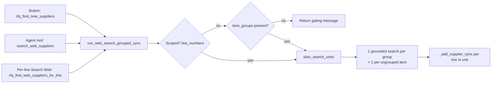

# Plan: Grouped Supplier Web Search

> Status: **PROPOSED — awaiting review** (2026-09-08)
> Related: [plan-rfqBulkOperations.prompt.md](plan-rfqBulkOperations.prompt.md),
> [plan-quoteRequestWorkflow.prompt.md](plan-quoteRequestWorkflow.prompt.md)
> Scope: one shared, group-optimised web supplier search used by the RFQ items
> toolbar and the procurement agent.

---

## 1. Background

Sourcing groups already exist: `_group_rfq_items_sync()` LLM-groups classified
items by brand/supply chain and stores them in `rfqs.item_groups` (JSONB:
`{groups, ungrouped, ungrouped_reason}`), prompted by
[config/prompts/rfq_item_grouping.md](../../config/prompts/rfq_item_grouping.md).

But today's **web supplier search ignores grouping entirely**:

| Path | Code | Behaviour |
|---|---|---|
| "Find New Suppliers" button | `rfq_find_new_suppliers` → `run_web_search_suppliers_sync()` | One grounded web search **per item** |
| Agent "find Australian/international suppliers" | `search_web_suppliers` tool → same `run_web_search_suppliers_sync()` | One grounded web search **per item** |
| Per-line "Find Suppliers" → "Search Web" | `rfq_find_web_suppliers_for_line` → `_web_search_suppliers_sync()` direct | One search for the one line |

Groups are only used today by `_cross_apply_suppliers_sync()` for
**Previous Sales / Brand Suppliers** (spread suppliers within groups) — never
for web search.

A designed group-aware path exists but is orphaned:
`config/prompts/rfq_find_all_suppliers.md` ("one search per group") is **never
loaded by any code**, and the `rfq_find_all_suppliers` action re-enters the
agent with a plain prompt that falls back to the per-item flow.

**Result:** a 30-line RFQ grouped into 3 sourcing groups runs ~30 paid web
searches instead of ~3.

---

## 2. Goals

1. **One shared core** — the button and the agent tool call the *same*
   function; only the transport differs (action handler vs LangGraph tool).
2. **Grouping gate** — unscoped web search is refused unless grouping has been
   *performed* (checked), even if the outcome was "no groups".
3. **One search per group / ungrouped item** — rich per-group prompts.
4. **Apply once, fan out** — suppliers found for a group are added to every
   line in the group (per-line writes, deduped by name).
5. **Single-line searches ride the same core** — explicit per-line requests
   become scoped runs with item-level units ("group of 1").

---

## 3. Design

### 3.1 Grouping "checked" marker (the gate)

- `rfqs.item_groups` is **cleared to NULL whenever items change**
  (`_add_items_sync`, edits, imports — `rfq_crud.py` ~621/872/947), so it is a
  natural invalidation signal.
- **Gap today:** `run_classify_sync()` only calls `_group_rfq_items_sync()` when
  there are ≥2 groupable items; otherwise `item_groups` stays NULL, so we
  cannot distinguish "never checked" from "checked, nothing to group".
- **Fix:** classification/grouping *always* persists a grouping state:
  - ≥2 groupable items → LLM result as today.
  - <2 groupable items → `{"groups": [], "ungrouped": [all classified lines], "ungrouped_reason": "..."}`.
  - The `group_items` tool and `rfq_group_items` action produce the same
    always-persisted state via `_update_item_groups_sync()`.
  - Generic items (not groupable) are included in `ungrouped` so they are
    still searched per item.
- **Gate = `rfq.item_groups is not None`** for *unscoped* searches.
  Present (even with zero groups) → proceed. NULL → refuse with a clear
  message pointing at grouping ("Run Group items / classify first").
- `pipeline_stage` is not used for the gate — its values
  ("unprocessed"/"classified"/"searching"/"complete") don't track grouping.

### 3.2 Search planning + prompt building — new pure module

**New file `includes/tools/sourcing_groups.py`** — pure functions, no LLM,
fully unit-testable:

- `load_sourcing_groups(rfq_dict) -> SourcingPlan`
  - Reads `rfq.item_groups`, maps line → group, computes coverage.
  - Any classified line not in `groups` nor `ungrouped` is treated as
    ungrouped (safety net).
- `plan_search_units(rfq_dict, line_numbers=None) -> list[SearchUnit]`
  - `SearchUnit`: `{kind: "group"|"item", lines: [...], prompt_kwargs: {...}}`.
  - **Unscoped:** one unit per group + one per ungrouped line. Unmatched items
    are excluded from units but *counted and reported*.
  - **Scoped:** for each requested line —
    - if the line belongs to a group AND **all** the group's lines are in
      scope → one group unit (full-group shortcut);
    - otherwise → an item-level unit for that line ("group of 1").
  - Dedup: requested lines that appear in a group unit are not also emitted as
    item units.
- `build_group_search_prompt(group, members) -> dict` — the richest possible
  context for one search:
  - group `label` + `reason`
  - distinct brands (or "no common brand")
  - up to 3 sample part numbers + total line count
  - item-type wording derived from member descriptions
  - aggregate quantity/UOM context
  - union of existing suppliers across the group (exclusion list)
  - geography instruction (domestic/international)
- `build_item_search_prompt(item) -> dict` — today's single-item prompt shape
  (description, part number, brand, quantity, existing suppliers).

### 3.3 Group-aware core — one shared function

**Replace the body of `run_web_search_suppliers_sync()`** in
`includes/tools/supplier_search_tools.py` (rename:
`run_web_search_grouped_sync(rfq_id, user_id, domestic_only=True, line_numbers=None)`):

1. Load RFQ dict.
2. **Auto-grouping if un-checked (unscoped only):** if `item_groups is NULL`:
   - Automatically run grouping inline via `_group_rfq_items_sync()`, persisting the new `item_groups` (even if 0 groups are found).
   - Report a brief notification: `"Grouping items before searching..."` (or include in the response summary: `"Grouped items into N group(s) before searching..."`).
   - If grouping cannot be performed (e.g. items are still `unmatched`), report: `"Items need to be classified before searching."`
3. `plan_search_units(...)`.
4. For each unit: **one** `_web_search_suppliers_sync(...)` using the unit's
   `prompt_kwargs`. (Can run with a bounded `ThreadPoolExecutor(max_workers=3)`
   for 3x faster multi-group searches, while writing results sequentially).
5. Apply: for **every** line in the unit —
   `_add_supplier_sync(rfq_id, {"line": l, "suppliers": found}, user_id)`.
   Safe because `_add_suppliers_to_line_core()` dedupes/merges by name and
   resolves DB matches per line.
6. `_sort_rfq_suppliers_sync(rfq_id)` + `pipeline_stage = "searching"`.
7. Report per unit: `"Group G1 (Furukawa Breaker Parts): 4 suppliers → applied to lines 1–8"`.

`_web_search_suppliers_sync()` (rfq_crud.py ~2977) stays as the single-search
engine; it gains `part_numbers: list[str] | None = None` so group prompts can
pass sample part numbers into the grounded research prompt.

### 3.4 Route alignment

| Entry | File | Change |
|---|---|---|
| Button "Find New Suppliers" | `rfq_actions.py` `on_rfq_find_new_suppliers` (~1019) | call `run_web_search_grouped_sync(rfq_id, user_id, domestic_only=True)` |
| Menu button "Australian Suppliers" | `rfq_actions.py` `on_rfq_pipeline_new_domestic` (~838) | call `run_web_search_grouped_sync(rfq_id, user_id, domestic_only=True, line_numbers=line_filter)` |
| Menu button "International Suppliers" | `rfq_actions.py` `on_rfq_pipeline_new_international` (~865) | call `run_web_search_grouped_sync(rfq_id, user_id, domestic_only=False, line_numbers=line_filter)` |
| Pipeline "Web Search" action | `rfq_actions.py` `on_rfq_pipeline_web_search` (~618) | replace ~150 lines of duplicate ad-hoc grouping code with `run_web_search_grouped_sync(rfq_id, user_id)` |
| Agent "find Australian/international suppliers" | `supplier_search_tools.py` `search_web_suppliers` tool | same function with `domestic_only`/`line_numbers` |
| Agent single-line ("…for line 3") | same tool | `line_numbers=[3]` → item unit |
| Per-line button → "Search Web" | `rfq_actions.py` `on_rfq_find_web_suppliers_for_line` (~426) | call the same core with `line_numbers=[line]` (Phase 1 internal-DB search + ask-before-web UX unchanged) |

Gate message surfacing:
- Button → `ctx.say()` in the chat panel + `dashboard_refresh`.
- Agent → tool return text the agent relays; agent may offer to run
  `group_items(rfq_id)`.

Optional UI: wire the existing `groupItems()` JS (`rfq_group_items` action,
`base.html` ~1348) to a visible "Group items" button in the RFQ items toolbar
next to the supplier-search buttons, so staff can satisfy the gate in one click.

### 3.5 Legacy batch prompt

`config/prompts/rfq_find_all_suppliers.md` becomes redundant — group search
moves into deterministic core code. **Retire the prompt file** and the
unwired `on_rfq_find_all_suppliers` handler (or keep the handler as a plain
re-entry; no prompt). No other code loads that prompt today.

### 3.6 Grouping invalidation (dirty flag)

Grouping is **invalidated, not rebuilt** — any grouping-relevant item
mutation sets `item_groups` to NULL and the gate forces a regroup before the
next unscoped search.

Current behaviour (verified in `rfq_crud.py`):

| Mutation path | Invalidates today? |
|---|---|
| `_add_items_sync` | ✅ `item_groups = None` (~621) |
| `_update_item_sync` | ✅ if any field changed (~872) |
| `_update_items_bulk_sync` | ✅ if any line changed (~947) |
| `_delete_item_sync` | ❌ **missing** — stale groups + line renumbering makes them actively wrong |
| `_delete_items_bulk_sync` | ❌ **missing** |

Required additions:

1. **Set `rfq.item_groups = None` in both delete paths** (single + bulk).
   Deletion renumbers lines, so stale groups would silently point at the
   wrong items.
2. **Tighten update invalidation to grouping-relevant fields.** Today *any*
   change — including `uom`, `quantity`, `sale_price` — clears grouping,
   forcing needless regroups. Define
   `GROUPING_FIELDS = {"input_description", "input_code", "part_number",
   "brand", "product_id", "match", "notes"}` and clear only when the change
   set intersects it. UOM/quantity/sale-price edits then leave groups intact.
   (`notes` stays in the set — §3.7 makes item notes a grouping input.)

Note: `_apply_validation_results` mutates `match`/`notes` without clearing,
but it only runs inside the classify pipeline before grouping is written, so
no stale-state risk today.

### 3.7 Equipment context — notes that define the items

RFQ line items are frequently meaningless without their context:
production example `RFQ-2026-1794` has items like "Transmission solenoids"
with no part numbers — everything that matters is in `rfqs.notes`:

> Equipment: Volvo G940 Grader (PIN: \*VCE0G940L00502901\*), Engine: Volvo D7E
> GBE3 (Code: C3GI165). Customer is requesting parts manuals/diagrams to release
> the parking brake and identify transmission solenoids…

Today that context never reaches grouping or search:

| Stage | Today |
|---|---|
| RFQ creation (`rfq_creation_extract.md`) | one free-text `customer_notes` mixing equipment context with commercial terms |
| Grouping (`_group_rfq_items_sync`) | receives only `{line, description, part_number, brand}` — **RFQ notes and item notes are not passed** |
| Group storage (`item_groups`) | `{id, label, reason, lines}` — **no context field** |
| Grouped search (this plan) | `build_group_search_prompt` uses label/reason/brands/part numbers — **no context** |

Design:

1. **Structured context extraction at creation.** Extend
   `rfq_creation_extract.md` + the pipeline to emit `equipment_context`
   alongside `customer_notes`:
   - `equipment_context` — structured list, one entry per machine/system:
     `{equipment: "Volvo G940 Grader", serial_or_pin, engine, application}`
     (e.g. application = "manuals/diagrams to release parking brake").
   - `customer_notes` — commercial/delivery requirements only.
   - Storage: new JSONB column `rfqs.equipment_context` (migration).
     `rfqs.notes` is unchanged. Optional re-extract action to backfill old
     RFQs (e.g. `classify_rfq_items` re-run could refresh it).
2. **Grouping inherits context.** Pass `equipment_context`, `notes`, and
   per-item `notes` into `_group_rfq_items_sync()`; extend
   `rfq_item_grouping.md` with a context-inheritance rule:
   - each group gains a `context` field — the LLM copies the relevant slice
     of the RFQ context (single-group RFQ → the whole context; multi-group →
     per-group slice, e.g. engine parts vs transmission parts);
   - item notes act as weak grouping signals (per-line hints).
   - `label` stays the short search-friendly name; `reason` may cite context.
3. **Search consumes context.** `build_group_search_prompt` includes group
   `context` + equipment details (machine model, serial/PIN, engine,
   application). This changes search steering materially — e.g. a
   "manuals/diagrams" application should search documentation sources, not
   parts distributors.
4. **Dirty-flag plumbing.**
   - RFQ `notes` or `equipment_context` edits must clear `item_groups`
     (currently `_update_rfq_sync` does not invalidate grouping for notes).
   - §3.6's `GROUPING_FIELDS` tightening must KEEP `notes` — item notes are
     now grouping input (only `uom`/`quantity`/`sale_price` drop out).

---

## 4. Scoping rules (summary)

| Request | Units | Gate |
|---|---|---|
| Unscoped ("all items") | 1 per group + 1 per ungrouped item | **Required** |
| Scope covers an entire group (e.g. lines 1–8 = G1) | 1 group unit, applied to all its lines | Not required |
| Single line / partial group | item units per requested line ("group of 1") | Not required |

Rationale: grouping exists to eliminate redundant searches across items; a
one-line scope has nothing to optimise, so the gate would be pure friction.
The per-line button therefore keeps working on RFQs that were never grouped.

---

## 5. Edge cases

- **0 groups, N ungrouped** → N item searches (same as today), gate satisfied
  by the persisted empty-group state.
- **1 classified item** → `{"groups": [], "ungrouped": [1]}` → 1 search.
- **Items edited or deleted after grouping** → `item_groups` NULL → gate
  re-locks with message; re-group and search.
- **Unmatched items** → excluded from units, counted in the report ("3 lines
  not searched — unmatched").
- **Line added after grouping** → item_groups is NULL (invalidation) → gate
  blocks. If somehow a line is missing from a stale state, coverage check
  treats it as ungrouped.
- **Existing suppliers** → union across group lines in the exclusion list so
  we don't re-find what we have.
- **Cost guard** → searches = groups + ungrouped (+ scoped item units).
  Optionally cap total units per run (suggest 20) with a clear message.
- **Suppliers apply to multiple lines** → per-line `_add_supplier_sync` with
  name-dedupe in `_add_suppliers_to_line_core` (no duplicates created).

---

## 6. Testing

New `tests/tools/test_sourcing_groups.py` (pure planning — no LLM):
- gate blocks unscoped when `item_groups` NULL; allows with zero groups
- units: one per group + one per ungrouped; no per-line duplicates
- group prompt contains label, reason, brands, sample part numbers
- group prompt includes equipment context (model/serial/engine/application)
  from `rfq.equipment_context` + group `context`
- scoped single line → one item unit ("group of 1")
- scope = full group → one group unit
- partial scope → item units only
- unmatched lines excluded and reported
- coverage safety net: stray line treated as ungrouped

Extend `tests/tools/test_supplier_search_tools.py` (mock `_web_search_suppliers_sync` + `_add_supplier_sync`):
- one search call per unit (call-count assertions)
- results applied to **all** lines of a group unit
- unscoped gating message returned verbatim
- invalidation: edits clear `item_groups` (existing
  `tests/tools/test_rfq_bulk.py::test_item_groups_cleared` covers the
  invalidation side); add coverage for single/bulk **delete** invalidation,
  for UOM-only edits **not** clearing groups, and for RFQ `notes` /
  `equipment_context` edits clearing groups

---

## 7. Files touched

| File | Change |
|---|---|
| `includes/tools/sourcing_groups.py` | **new** — planning + prompt building (pure) |
| `includes/tools/supplier_search_tools.py` | group-aware core; classify always persists grouping state |
| `includes/tools/rfq_crud.py` | `part_numbers` param; delete-path invalidation; tighten invalidation fields; grouping prompt gains context inputs |
| `includes/tools/rfq_creation_pipeline.py` | extract + store `equipment_context` |
| `includes/dashboard/models.py` + alembic | `rfqs.equipment_context` JSONB |
| `includes/chat/rfq_actions.py` | button + per-line handlers → shared core |
| `templates/partials/rfq_detail.html` | optional "Group items" toolbar button |
| `config/prompts/rfq_item_grouping.md` | context-inheritance rules + `context` per group |
| `config/prompts/rfq_creation_extract.md` | split `equipment_context` out of `customer_notes` |
| `config/prompts/rfq_find_all_suppliers.md` | retire |

---

## 8. Open questions

1. ~~Gate behaviour: **refuse-and-prompt** vs auto-run?~~ *Resolved: Auto-run grouping if `item_groups is NULL` and proceed directly with search, notifying the user.*
2. Retire `rfq_find_all_suppliers.md` + handler? (recommended yes)
3. Include the visible "Group items" toolbar button in this change?
4. Unit cap for one run (suggest 20)?
5. Should scoped searches surface group context in the prompt when the line
   belongs to a group but the scope is single-line? (Recommend no — keep
   single-line prompts self-contained.)

---

## 9. Implementation order

1. `sourcing_groups.py` + unit tests (pure logic first).
2. `rfq_crud.py`: `part_numbers` param + invalidation fixes (delete paths,
   tighten fields, RFQ notes/equipment-context invalidation) + tests.
3. Equipment context: migration + `rfq_creation_extract.md` split +
   pipeline extraction; grouping prompt gains context inheritance
   (`rfq_item_grouping.md` + `_group_rfq_items_sync` inputs + per-group
   `context`).
4. `run_web_search_grouped_sync` core + gating; update
   `run_classify_sync`/`group_items` to always persist grouping state.
5. Re-wire the entry points; group prompts consume equipment context.
6. Tests for the core; full suite green.
7. Optional toolbar button + prompt retirement.
8. Manual smoke: grouped RFQ → one search per group; ungrouped RFQ → gating
   message; per-line → single search, no gate; machine-context RFQ → group
   context present in searches.
