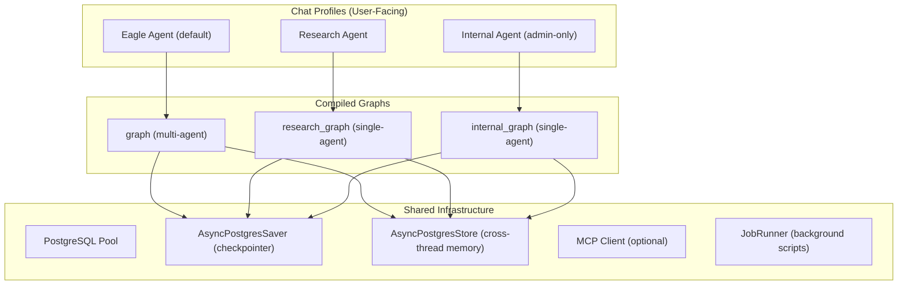
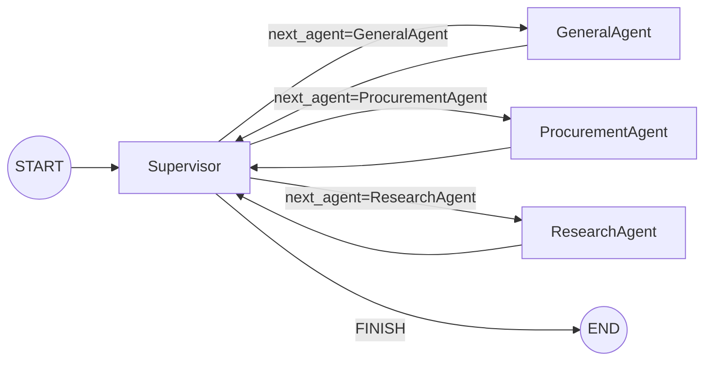
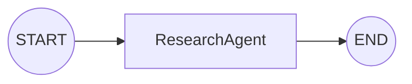
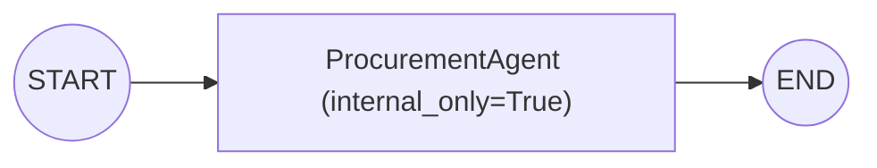
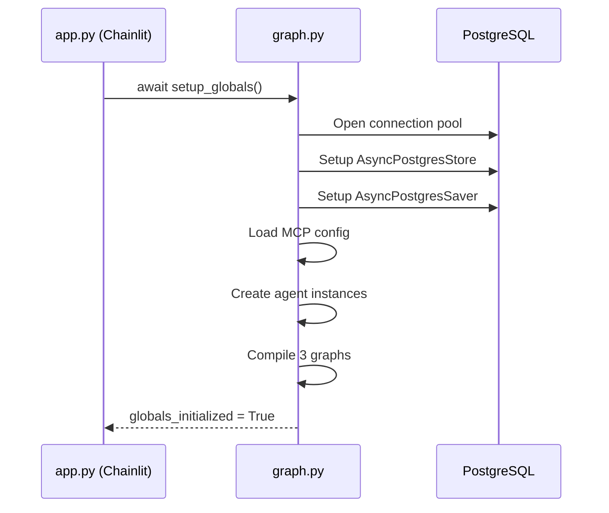

# Agent & Graph Architecture

## Overview

EagleAgent uses **LangGraph** to orchestrate a multi-agent system built on **Gemini** models (via `langchain-google-genai`). The system exposes three compiled graphs corresponding to three **Chainlit chat profiles**. All graphs share a PostgreSQL-backed checkpointer and cross-thread memory store.

---

## High-Level Diagram



---

## Graph 1: Eagle Agent (Multi-Agent Supervisor)

The primary graph. A **Supervisor** routes user messages to specialized sub-agents in a loop.



### Routing Logic (Supervisor)

1. **If last message is AI** → `FINISH` (user turn expected)
2. **Intent-based routing** — action buttons inject `intent_context` into state:
   - `research_suppliers`, `web_research` → **ResearchAgent**
   - `search_products`, `search_suppliers`, `search_brands`, `part_purchase_history`, `search_purchase_history` → **ProcurementAgent**
3. **LLM-based routing** — Supervisor asks the model (with structured output) to pick `GeneralAgent | ProcurementAgent | FINISH`
   - Fallback on error: **GeneralAgent**

### State Schema (`SupervisorState`)

| Field | Type | Purpose |
|-------|------|---------|
| `messages` | `Sequence[BaseMessage]` | Conversation history (with `add_messages` reducer) |
| `user_id` | `str` | User email for profile/memory lookup |
| `file_attachments` | `list[dict]` (optional) | Uploaded file metadata |
| `next_agent` | `str` (optional) | Routing decision from Supervisor |
| `intent_context` | `str` (optional) | UI-injected intent signal |

---

## Graph 2: Research Agent (Standalone)

A single-node graph for focused web research. **No RFQ tools** — only Google Search grounding + profile tools.



---

## Graph 3: Internal Agent (Standalone)

A single-node graph restricted to internal database queries. No web access, no RFQ tools. Available to all users.



---

## Agent Inventory

| Agent | Class | Tools | Native Tools | Model Override Env Var |
|-------|-------|-------|--------------|----------------------|
| **Supervisor** | `Supervisor` | _(none — routing only)_ | — | `SUPERVISOR_MODEL` (default: `gemini-2.0-flash`) |
| **GeneralAgent** | `GeneralAgent` | Profile tools, Action tools, MCP tools | Google Search grounding | `GENERAL_AGENT_MODEL` |
| **ProcurementAgent** | `ProcurementAgent` | `search_products`, `search_brands`, `search_suppliers`, `part_purchase_history`, `search_purchase_history`, RFQ tools (quote_tools) | — | `PROCUREMENT_AGENT_MODEL` |
| **ResearchAgent** | `ResearchAgent` | Profile tools, (optionally RFQ tools when embedded in Eagle graph) | Google Search grounding | `RESEARCH_AGENT_MODEL` |
| **BrowserAgent** | `BrowserAgent` | Browser automation tools | Google Search grounding | `BROWSER_AGENT_MODEL` |
| **SysAdminAgent** | `SysAdminAgent` | Profile tools, Job management tools | — | `SYSADMIN_AGENT_MODEL` |

> **Note:** `BrowserAgent` and `SysAdminAgent` are defined but **not currently wired into any compiled graph**. They exist as classes ready to be integrated.

---

## Agent Base Class (`BaseSubAgent`)

All agents inherit from `BaseSubAgent` which provides:

- **Tool binding** — `get_tools(user_id)` / `get_tools_async(user_id)` + optional `get_native_tools()` for Gemini built-in tools
- **System prompt** — `get_system_prompt()` / `get_system_prompt_async(user_id)` with dynamic profile data
- **Message trimming** — Keeps last 30 messages (configurable via `max_messages`)
- **Thought signature stripping** — Removes Gemini thought signatures from checkpointed messages to prevent 400 errors on replay
- **Retry with backoff** — Auto-retries on transient 429/503 errors (max 3 attempts)
- **ReAct execution** — Uses `langgraph.prebuilt.create_react_agent` for tool-calling loop

### Gemini 2.5 Limitation

When using Gemini 2.5 models, native tools (Google Search) and LangChain function-calling tools **cannot be combined** in the same request. The base class auto-drops LangChain tools when native tools are present on 2.5 models.

---

## Tool Categories

| Tool Module | Tools | Used By |
|-------------|-------|---------|
| `tools/product_tools.py` | `search_products`, `search_brands`, `search_suppliers`, `part_purchase_history`, `search_purchase_history` | ProcurementAgent |
| `tools/quote_tools.py` | RFQ CRUD (`get_rfq`, `manage_rfq`, etc.) | ProcurementAgent, ResearchAgent (embedded) |
| `tools/user_profile.py` | Profile read/write tools | GeneralAgent, ResearchAgent, SysAdminAgent |
| `tools/action_tools.py` | `list_actions`, `new_conversation`, `delete_all_user_data` | GeneralAgent |
| `tools/browser_tools.py` | Browser automation tools | BrowserAgent |
| `tools/job_tools.py` | Job management (run/status/cancel scripts) | SysAdminAgent |
| MCP tools | Dynamic (loaded from `config/mcp_servers.yaml`) | GeneralAgent |

---

## Model Configuration

| Setting | Default | Purpose |
|---------|---------|---------|
| `DEFAULT_MODEL` | `gemini-3-flash-preview` | Fallback model for all agents |
| `SUPERVISOR_MODEL` | `gemini-2.0-flash` | Fast model for routing decisions |
| `DEFAULT_TEMPERATURE` | `0.7` | Creativity setting |
| `DEFAULT_MAX_TOKENS` | `8192` | Response length limit |
| `GRAPH_RECURSION_LIMIT` | `50` | Max LangGraph steps before abort |

Per-agent overrides via env vars: `GENERAL_AGENT_MODEL`, `PROCUREMENT_AGENT_MODEL`, `RESEARCH_AGENT_MODEL`, `BROWSER_AGENT_MODEL`, `SYSADMIN_AGENT_MODEL`.

---

## Initialization Flow



---

## Chat Profile → Graph Mapping (app.py)

| Chat Profile | Graph Variable | Nodes Active |
|-------------|---------------|--------------|
| "Eagle Agent" | `graph` | Supervisor → GeneralAgent / ProcurementAgent / ResearchAgent |
| "Research Agent" | `research_graph` | ResearchAgent (standalone, no RFQ tools) |
| "Internal Agent" | `internal_graph` | ProcurementAgent (internal_only=True, DB-only) |

---

## File Structure

```
includes/
├── graph.py                 # Graph construction, setup_globals(), model factory
├── agents/
│   ├── __init__.py          # Exports all agent classes
│   ├── base.py              # BaseSubAgent ABC (execution, trimming, retries)
│   ├── supervisor.py        # Supervisor routing node
│   ├── general_agent.py     # General conversation + MCP + Google Search
│   ├── procurement_agent.py # Product/supplier DB search + RFQ management
│   ├── research_agent.py    # Web research via Google Search grounding
│   ├── browser_agent.py     # Browser automation (not in active graphs)
│   └── sysadmin_agent.py    # Script/job runner (not in active graphs)
├── tools/
│   ├── product_tools.py     # DB search tools
│   ├── quote_tools.py       # RFQ CRUD tools
│   ├── user_profile.py      # Profile management
│   ├── action_tools.py      # Action/command tools
│   ├── browser_tools.py     # Browser automation
│   ├── job_tools.py         # Background job management
│   └── rfq_crud.py          # RFQ database operations
└── mcp_config.py            # MCP server configuration loader
```
