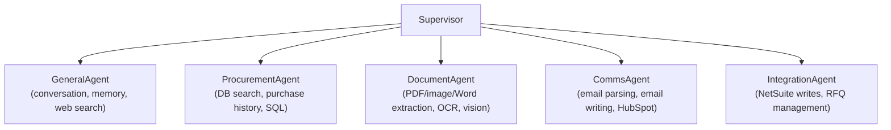
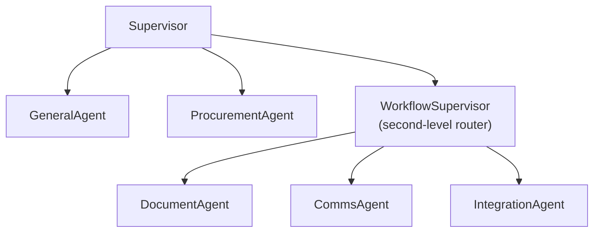

# Future Agent Planning

## Current State (May 2025)

The Eagle Agent graph has 3 active sub-agents routed by a Supervisor:

- **GeneralAgent** — Conversation, memory, Google Search grounding, MCP tools
- **ProcurementAgent** — Internal DB search (products, suppliers, brands, purchase history), RFQ management
- **ResearchAgent** — Web research via Google Search grounding (reachable via intent signals only)

## Emerging Tasks

| Task | Description |
|------|-------------|
| Document processing | Reading PDF/Image/Word to extract part numbers (typically tabular) |
| Image processing | Identifying parts/products from a photograph |
| Email parsing | Reading incoming email, determining intent, discovering products/parts |
| RFQ management | Complex workflow currently inside ProcurementAgent |
| Internal DB search | Scanning internal database, potentially with SQL capabilities |
| Email creation | Writing and sending emails to mailboxes |
| NetSuite updates | Updating invoices and data in NetSuite |
| HubSpot updates | Posting info to HubSpot CRM |

## Design Principles

### The Core Tradeoff

| More Agents | Fewer Agents |
|---|---|
| ✅ Isolated tools (fewer per agent = better tool selection) | ✅ Simpler routing (fewer choices = fewer errors) |
| ✅ Per-agent model selection (vision model for images, cheap model for parsing) | ✅ Less supervisor overhead (each routing call costs latency + tokens) |
| ✅ Focused system prompts (shorter = better adherence) | ✅ Shared context (agent sees full picture without hand-offs) |
| ❌ Routing gets harder (supervisor must distinguish 8+ options) | ❌ Tool overload (Gemini degrades with 15+ tools) |
| ❌ Hand-off context loss (each agent starts fresh from state) | ❌ Bloated prompts (one agent doing everything) |

### When to Split Into a New Agent

Split only when a task needs:
- A **different model** (e.g. vision-capable for images)
- A **distinct tool set** that would bloat another agent
- **Different safety/confirmation requirements** (writes vs reads)

Don't split just because a task has a name — split when the tools or model requirements diverge.

### Routing Sweet Spot

The supervisor LLM reliably handles **4-6 routing choices**. Beyond that, routing errors increase significantly. If the task list grows beyond 6 agents, use sub-routing (nested supervisors).

---

## Recommended Architecture: Capability Clusters

Group by **shared tools and context**, not by individual task. Target 5-6 agents max in the supervisor graph.

### Cluster Rationale

| Cluster | Tasks | Why Grouped |
|---------|-------|-------------|
| **ProcurementAgent** | Internal DB search, product/supplier lookup, (future SQL) | All read-only DB operations. Same tools, same context. |
| **DocumentAgent** | PDF extraction, image identification, Word parsing | All need multimodal/vision model. Shared toolset (OCR, table extraction). Distinct from conversation. |
| **CommsAgent** | Email parsing, email creation, HubSpot posts | All deal with external communication. Shared context (contacts, tone, templates). |
| **IntegrationAgent** | NetSuite updates, RFQ management | All perform **writes to external systems**. Isolating write operations enables confirmation flows, audit logging, and stricter validation in one place. |
| **GeneralAgent** | Conversation, memory, web search, anything else | Catch-all with Google Search grounding. |

### Why RFQ Belongs in IntegrationAgent (Not Standalone)

RFQ management involves creating quotes, updating line items, changing status, and sending to suppliers. These are all **write operations** with real business consequences — same category as NetSuite invoice updates. Grouping writes together lets you:
- Apply a single confirmation/approval pattern
- Use a more cautious model (lower temperature)
- Add audit logging in one place
- Share "careful operation" system prompt guidance

---

## Implementation Roadmap

You don't need to build all of these now. Incremental path:

1. **Now** — Keep current 3 agents (GeneralAgent, ProcurementAgent, ResearchAgent)
2. **Next** — Add `DocumentAgent` when PDF/image extraction is implemented (needs a vision-capable model)
3. **Then** — Add `CommsAgent` when email integration lands
4. **Later** — Split writes into `IntegrationAgent` when NetSuite/RFQ writes become complex enough

Each new agent requires:
- A new class extending `BaseSubAgent` in `includes/agents/`
- A node added to the graph in `includes/graph.py`
- One more option in the `RouteDecision` literal in `supervisor.py`
- One more description line in the supervisor routing prompt

---

## Scaling Beyond 6: Sub-Routing

If the agent count eventually exceeds 6, introduce a second-level supervisor:

The top-level supervisor decides "is this a conversation/lookup, or a workflow task?" — then the workflow supervisor picks the specific agent. Each routing decision stays at 3-4 options.

---

## Model Strategy Per Agent

| Agent | Recommended Model Profile | Rationale |
|-------|--------------------------|-----------|
| Supervisor | Fast/cheap (gemini-2.0-flash) | Only picks a route, no content generation |
| GeneralAgent | Standard (gemini-3-flash) | Conversation quality matters |
| ProcurementAgent | Standard (gemini-3-flash) | Needs good tool selection |
| DocumentAgent | Vision-capable (gemini-3-flash or pro) | Must process images and complex tables |
| CommsAgent | Standard with good writing | Email tone and formatting matters |
| IntegrationAgent | Conservative (lower temperature) | Write operations need precision over creativity |
